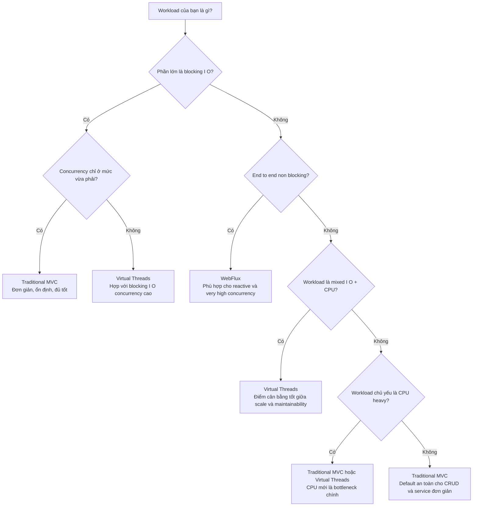

# Spring MVC vs Virtual Threads vs WebFlux: Chọn gì cho đúng workload?

Khi nói về hiệu năng trong Spring Boot, câu hỏi quen thuộc thường là:

**nên dùng `Traditional MVC`, `Virtual Threads`, hay `WebFlux`?**

Nghe thì giống một cuộc thi để tìm ra “người thắng cuộc”. Nhưng sau khi nhìn vào benchmark của repository này, kết luận hợp lý hơn lại là:

> **Không có lựa chọn tốt nhất cho mọi trường hợp. Mỗi mô hình phù hợp với một loại workload khác nhau.**

Bài viết này được viết lại theo hướng đó: dễ đọc hơn, dễ publish hơn, và tập trung vào **tiêu chí lựa chọn** thay vì chỉ nhìn một bảng throughput.

Nếu phải tóm tắt thật ngắn về `WebFlux`, thì điểm nổi bật nhất của nó là:

> **`WebFlux` nổi bật nhất khi request không bận tính toán hay block I/O theo kiểu truyền thống, mà chủ yếu là chờ non-blocking hoặc stream dữ liệu theo thời gian cho rất nhiều kết nối đồng thời.**

Phân tích dựa trên kết quả trong [load-test-results-20260306-102118](load-test-results-20260306-102118), cùng với bối cảnh kỹ thuật trong [README.md](README.md) và [TESTING-GUIDE.md](TESTING-GUIDE.md).

## Sơ đồ chọn nhanh

Nếu muốn rút gọn bài viết chỉ còn một ý, thì sơ đồ trên chính là phần quan trọng nhất: **hãy chọn mô hình theo bản chất workload, không chỉ theo hype hoặc một bảng benchmark đơn lẻ.**

## Trước tiên: benchmark này thực sự đang đo cái gì?

Muốn đọc đúng benchmark, phải hiểu đúng cách ba ứng dụng đang chạy.

- `Traditional MVC` xử lý request bằng Tomcat platform threads trong [spring-mvc-traditional/src/main/java/com/performance/mvc/PerformanceController.java](spring-mvc-traditional/src/main/java/com/performance/mvc/PerformanceController.java)
- `Virtual Threads` cấu hình Tomcat dùng virtual-thread-per-task executor trong [spring-virtual-threads/src/main/java/com/performance/virtual/AppConfig.java](spring-virtual-threads/src/main/java/com/performance/virtual/AppConfig.java)
- `WebFlux` không chạy end-to-end non-blocking, mà bọc blocking work bằng `Mono.fromCallable(...).subscribeOn(Schedulers.boundedElastic())` trong [spring-webflux/src/main/java/com/performance/webflux/PerformanceController.java](spring-webflux/src/main/java/com/performance/webflux/PerformanceController.java)
- `DatabaseSimulator` vẫn là blocking vì dùng `Thread.sleep(...)` và synchronous CPU loops trong [common/src/main/java/com/performance/common/DatabaseSimulator.java](common/src/main/java/com/performance/common/DatabaseSimulator.java)

Vì vậy benchmark hiện tại **không phải** là cuộc so sánh “pure reactive vs pure blocking”. Nó đang đo:

- blocking MVC
- blocking MVC chạy trên virtual threads
- blocking work được offload qua WebFlux bounded elastic scheduler

Đó là chi tiết quan trọng nhất để hiểu vì sao một số kết quả của `WebFlux` trông không giống kỳ vọng phổ biến.

## Bối cảnh test ngắn gọn

Một vài thông số cấu hình ảnh hưởng trực tiếp đến kết quả:

- MVC giới hạn `200` Tomcat worker threads trong [spring-mvc-traditional/src/main/resources/application.properties](spring-mvc-traditional/src/main/resources/application.properties)
- `Virtual Threads` được bật thật trong [spring-virtual-threads/src/main/java/com/performance/virtual/AppConfig.java](spring-virtual-threads/src/main/java/com/performance/virtual/AppConfig.java)
- `WebFlux` dùng Reactor Netty với `reactor.netty.ioWorkerCount=8` trong [spring-webflux/src/main/resources/application.properties](spring-webflux/src/main/resources/application.properties)
- Kubernetes deployment đang chạy `2` replicas, mỗi pod giới hạn `2000m` CPU trong:
  - [deployment/kubernetes/spring-mvc-traditional.yaml](deployment/kubernetes/spring-mvc-traditional.yaml)
  - [deployment/kubernetes/spring-virtual-threads.yaml](deployment/kubernetes/spring-virtual-threads.yaml)
  - [deployment/kubernetes/spring-webflux.yaml](deployment/kubernetes/spring-webflux.yaml)

## Kết quả benchmark: đọc sao cho đúng?

## 1. Blocking query thông thường: `/api/query`

| Implementation | Avg Latency | Requests/sec | Nhận xét |
|---|---:|---:|---|
| Traditional MVC | 125.73 ms | 1588.73 | Baseline rất tốt |
| Virtual Threads | 125.39 ms | 1593.22 | Gần như tương đương MVC |
| WebFlux | 312.67 ms | 639.29 | Tệ hơn rõ rệt với workload blocking |

Ở scenario này, `Traditional MVC` và `Virtual Threads` gần như hòa nhau.

Điều đó hoàn toàn hợp lý vì workload là blocking và concurrency chưa đủ cao để MVC bị saturation mạnh. Nói ngắn gọn: `MVC` vẫn đang ở vùng hoạt động thoải mái.

Trong khi đó, `WebFlux` phải offload blocking work sang `boundedElastic`, nên phát sinh thêm scheduling overhead và queueing delay. Vì vậy latency tăng lên khá rõ và throughput giảm mạnh.

## 2. Blocking query dài: `/api/query/500`

| Implementation | Avg Latency | Requests/sec | Errors |
|---|---:|---:|---|
| Traditional MVC | 502.02 ms | 398.00 | Không ghi nhận lỗi |
| Virtual Threads | 502.06 ms | 398.01 | Không ghi nhận lỗi |
| WebFlux | 1.23 s | 159.29 | 445 timeouts |

Đây là case dễ đọc nhất trong toàn bộ benchmark.

Với `200` connections và service time khoảng `500ms`, trần throughput lý thuyết là:

$$
\frac{200}{0.502} \approx 398 \text{ req/s}
$$

Cả `Traditional MVC` lẫn `Virtual Threads` đều chạm gần như đúng ngưỡng đó.

Điều này cho thấy ở mức tải hiện tại, hai mô hình này đều xử lý blocking delay rất hiệu quả.

`WebFlux` lại tụt khá xa, kèm timeout. Đây là dấu hiệu phù hợp với bounded elastic scheduler bị queue buildup khi phải gánh blocking tasks kéo dài.

## 3. CPU-intensive endpoint: `/api/cpu/100`

| Implementation | Avg Latency | Requests/sec | Timeouts | Non-2xx |
|---|---:|---:|---:|---:|
| Traditional MVC | 365.15 ms | 314.67 | 3519 | 0 |
| Virtual Threads | 43.75 ms | 3765.09 | 4825 | 445233 |
| WebFlux | 558.55 ms | 228.14 | 3544 | 0 |

Nếu chỉ nhìn `Requests/sec`, ai cũng dễ kết luận `Virtual Threads` thắng áp đảo. Nhưng đó là kết luận sai.

Lý do rất đơn giản: run này có tới `445233` response non-2xx. Tức là phần lớn “throughput” là **failed requests**, không phải successful work.

Đây là lý do vì sao benchmark không thể chỉ nhìn một cột throughput.

Với CPU-bound workload, bottleneck chính là CPU cores chứ không phải kiểu thread. `Virtual Threads` rất tốt cho waiting concurrency, nhưng không tạo thêm CPU capacity.

## 4. Mixed stress workload: `/api/stress?queries=5&cpuMs=100`

| Implementation | Avg Latency | Requests/sec | Timeouts | Non-2xx |
|---|---:|---:|---:|---:|
| Traditional MVC | 842.71 ms | 236.46 | 0 | 0 |
| Virtual Threads | 1.39 s | 52.53 | 4623 | 83 |
| WebFlux | 114.94 ms | 4366.09 | 5792 | 514499 |

Đây là case dễ gây hiểu lầm nhất.

Thoạt nhìn, `WebFlux` có vẻ cực nhanh: `4366.09 req/s`. Nhưng đi kèm là `514499` non-2xx và `5792` timeouts. Nói cách khác, phần lớn throughput đó là **fast failures**.

Nếu chỉ tính successful completed requests, `WebFlux` rơi xuống khoảng:

$$
\frac{524324 - 514499}{120} \approx 81.9 \text{ successful req/s}
$$

Trong scenario này, `Traditional MVC` mới là implementation cho kết quả ổn định và usable nhất.

## Những điều benchmark này thật sự chứng minh

### `Virtual Threads` là thật, không phải chỉ đổi tên

Implementation này dùng virtual threads thật sự qua `Executors.newVirtualThreadPerTaskExecutor()` trong [spring-virtual-threads/src/main/java/com/performance/virtual/AppConfig.java](spring-virtual-threads/src/main/java/com/performance/virtual/AppConfig.java).

### `Virtual Threads` không tự động thắng MVC

Ở mức concurrency hiện tại, `Virtual Threads` chưa outperform rõ rệt `Traditional MVC`. Điều đó không có nghĩa virtual threads không đáng giá; nó chỉ cho thấy benchmark chưa đẩy MVC đến vùng saturation đủ cao.

### `WebFlux` đang bị bất lợi bởi cách benchmark được thiết kế

`WebFlux` mạnh nhất khi toàn bộ request path là non-blocking. Trong repository này, blocking simulator được bọc trong reactive shell, nên benchmark chưa phản ánh đúng sân chơi đẹp nhất của `WebFlux`.

### `Requests/sec` không bao giờ nên đứng một mình

CPU test và stress test cho thấy nếu không nhìn cùng lúc:

- success rate
- timeout count
- non-2xx count

thì rất dễ rút ra kết luận sai.

## Vậy rốt cuộc nên chọn gì?

Đây mới là phần quan trọng nhất.

## Heavy blocking I/O workload

Ví dụ:

- database access
- external HTTP calls
- network waits
- file I/O
- long blocking delays

### Default fit tốt nhất: `Virtual Threads`

Vì sao?

- vẫn giữ được style code blocking quen thuộc
- scale tốt hơn khi có nhiều request cùng chờ I/O
- migration từ MVC thường rẻ
- phù hợp với service Java 21+ muốn tăng concurrency mà không rewrite lớn

### Khi nào `Traditional MVC` vẫn là lựa chọn tốt?

Khi:

- concurrency chỉ ở mức vừa phải
- thread pool chưa bị saturation
- ưu tiên lớn nhất là đơn giản và ổn định

### `WebFlux` có hợp không?

Có, nhưng chỉ khi stack **thật sự non-blocking end-to-end**. Benchmark hiện tại không chứng minh `WebFlux` yếu nói chung; nó chỉ cho thấy `WebFlux + blocking backend` là một tổ hợp không tối ưu.

## Heavy CPU-bound workload

Ví dụ:

- JSON transformation
- encryption / hashing
- report generation
- aggregation logic
- complex calculations

### Lựa chọn hợp lý: `Traditional MVC` hoặc `Virtual Threads`

Ở workload CPU-heavy, bottleneck là CPU. Vì vậy:

- chọn `Traditional MVC` nếu service đơn giản và concurrency không quá cao
- chọn `Virtual Threads` nếu service ngoài CPU work vẫn có thêm blocking I/O đáng kể

### Vì sao `WebFlux` không phải default fit tốt nhất?

Với CPU-bound endpoints, `WebFlux` thường làm tăng complexity mà không mang lại lợi ích rõ ràng, trừ khi nó là một phần của reactive platform lớn hơn.

## Mixed I/O + CPU workload

Ví dụ:

- đọc dữ liệu rồi transform
- gọi downstream service rồi aggregate response
- query, xử lý rồi serialize kết quả

### Default fit thực dụng nhất: `Virtual Threads`

Đây là loại workload phổ biến nhất trong business applications thực tế.

`Virtual Threads` phù hợp vì:

- có đủ blocking I/O để hưởng lợi
- code vẫn dễ đọc
- migration cost thấp hơn nhiều so với rewrite reactive
- là điểm cân bằng tốt giữa scalability và maintainability

Nếu phải chọn một default fit cho nhiều Java 21+ services hiện nay, đây thường là lựa chọn an toàn và hợp lý nhất.

## Very high concurrency với true non-blocking I/O

Ví dụ:

- API gateway
- streaming services
- event-driven systems
- reactive microservices dùng non-blocking database/client

### Lựa chọn phù hợp nhất: `WebFlux`

Đây mới là sân chơi thực sự của `WebFlux`.

Khi toàn bộ stack là non-blocking:

- database layer non-blocking
- upstream/downstream clients non-blocking
- team quen với reactive programming

thì `WebFlux` có thể scale concurrency rất tốt và tránh chi phí gắn tiến trình request với blocked threads.

Nếu các điều kiện trên không có, `WebFlux` thường tăng complexity nhanh hơn giá trị nó mang lại.

## Khi nào `WebFlux` thật sự nổi bật?

Nếu muốn nói ngắn gọn, `WebFlux` không nổi bật nhất ở các bài test blocking được “bọc reactive”. Nó nổi bật nhất ở các trường hợp như:

- rất nhiều request cùng chờ non-blocking
- long-lived connections
- streaming response theo thời gian
- SSE, notification stream, event feed
- API gateway hoặc reactive service dùng non-blocking clients end-to-end

Nói cách khác, `WebFlux` mạnh nhất khi server không cần giữ một blocked thread cho mỗi request đang chờ.

Đó cũng là lý do endpoint như `/api/wait/{delayMs}` và `/api/sse/{events}` là những bài test phù hợp hơn để làm nổi bật giá trị thực sự của `WebFlux`.

## Low-complexity CRUD services

### Lựa chọn hợp lý nhất: `Traditional MVC`

Cho internal services, admin APIs hoặc CRUD-oriented systems, `Traditional MVC` vẫn cực kỳ mạnh vì:

- dễ hiểu nhất
- dễ debug nhất
- vận hành quen thuộc
- đủ nhanh cho phần lớn moderate-concurrency workloads

## Decision matrix: workload nào hợp với mô hình nào?

| Workload type | Recommended default | Lý do chính |
|---|---|---|
| Heavy blocking I/O | Virtual Threads | Scale blocking concurrency tốt mà vẫn giữ code đơn giản |
| Moderate blocking I/O | Traditional MVC hoặc Virtual Threads | MVC thường đủ tốt trước khi saturation xuất hiện |
| Heavy CPU | Traditional MVC hoặc Virtual Threads | CPU mới là bottleneck chính |
| Mixed I/O + CPU | Virtual Threads | Điểm cân bằng tốt giữa scale và maintainability |
| True non-blocking, very high concurrency | WebFlux | Phù hợp nhất cho end-to-end reactive execution |
| Simple CRUD / low complexity | Traditional MVC | Complexity thấp nhất, dễ vận hành nhất |

## Khi đánh giá framework, nên nhìn tiêu chí nào?

Thay vì chỉ hỏi:

> “Cái nào nhanh hơn?”

nên hỏi:

1. workload chính là gì?
   - blocking I/O
   - CPU-bound
   - mixed I/O + CPU
   - true non-blocking event flow

2. expected concurrency là bao nhiêu?
   - vài chục
   - vài trăm
   - vài nghìn+

3. stack hiện tại đang blocking hay non-blocking end-to-end?

4. team chịu được bao nhiêu complexity?
   - MVC đơn giản nhất
   - Virtual Threads vẫn giữ được sự đơn giản
   - WebFlux cần nhiều discipline và expertise hơn

5. migration cost là bao nhiêu?
   - MVC sang Virtual Threads thường rẻ
   - MVC sang true reactive WebFlux thường đắt

6. metric nào quan trọng nhất?
   - throughput
   - p95 / p99 latency
   - success rate
   - error count
   - memory footprint
   - implementation complexity

## Nếu muốn benchmark này public hơn, nên cải thiện gì?

### 1. Benchmark `WebFlux` với true non-blocking workload

Ví dụ dùng:

- non-blocking database driver
- non-blocking HTTP client
- reactive end-to-end path

### 2. Luôn report success rate

Mỗi bảng kết quả nên có thêm:

- successful requests/sec
- timeout count
- non-2xx count
- success percentage

### 3. Đẩy concurrency vượt xa vùng comfortable của MVC

Nếu muốn thấy rõ khác biệt giữa `Traditional MVC` và `Virtual Threads`, cần test ở mức concurrency cao hơn đáng kể so với `200`.

### 4. Gắn benchmark với runtime telemetry

Nên đối chiếu kết quả với:

- pod logs
- ingress logs
- actuator metrics
- CPU / memory / thread usage

## Kết luận

Bài test này không cho thấy “ai thắng” trong mọi trường hợp.

Nó cho thấy một điều thực tế hơn nhiều:

> **`Traditional MVC`, `Virtual Threads`, và `WebFlux` nên được chọn theo loại workload, mức concurrency, kiến trúc blocking/non-blocking và chi phí vận hành.**

Nếu rút gọn thành guideline dễ nhớ, có thể là:

- chọn **Traditional MVC** cho CRUD service đơn giản, moderate concurrency, low complexity
- chọn **Virtual Threads** cho blocking hoặc mixed workloads khi cần tăng concurrency mà không muốn rewrite lớn
- chọn **WebFlux** cho hệ thống thực sự reactive, non-blocking end-to-end và cần very high concurrency

Và cuối cùng, có một nguyên tắc không nên bỏ qua trong mọi benchmark:

> **Throughput cao không có ý nghĩa nếu nó đi kèm với failure rate cao.**
